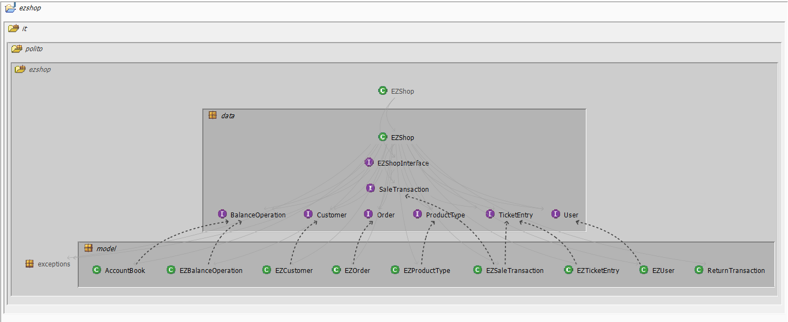
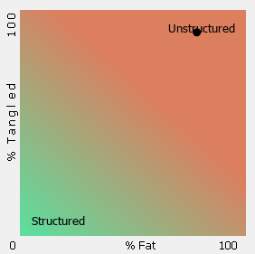
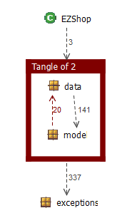

# Design assessment

Authors: Alessio Santangelo, Andrea Cencio, Damiano Bonaccorsi, Lorenzo Chiola

Date: 03 June 2021

Version: 1.0

## Levelized structure map

## Structural over complexity chart

## Size metrics

| Metric                                    |  Measure |
| ----------------------------------------- | -------- |
| Packages                                  |   6      |
| Classes (outer)                           |   38     |
| Classes (all)                             |   38     |
| NI (number of bytecode instructions)      |   7,037  |
| LOC (non comment non blank lines of code) |   3,026  |

## Items with XS

| Item | Tangled | Fat  | Size | XS   |
| ---- | ------- | ---- | ---- | ---- |
| ezshop.it.polito.ezshop.data.EZShop     |  -       |    201  |   5,914   |  2,383    |
| ezshop.it.polito.ezshop  |   4%      |  4    |   7,037   | 280     |
| ezshop.it.polito.ezshop.data.EZShop.EZShop():void  |   -    |  4    |   7,037   | 280     |
| ezshop.it.polito.ezshop.data.EZShop.endReturnTransaction(java.lang.Integer, boolean):boolean  |   -      |  17    |   470   | 55     |
| ezshop.it.polito.ezshop.data.EZShop.modifyCustomer(java.lang.Integer, java.lang.String, java.lang.String):boolean  |   -  |  1 | 185 | 21  |
| ezshop.it.polito.ezshop.data.EZShop.deleteReturnTransaction(java.lang.Integer):boolean |   -      |  16| 257 | 16 |

## Package level tangles

## Summary analysis

The design delivered on April 30 is quite alike to the current structure (not considering the interfaces that aren't showed in the design delivered on April 30). The current structure shows weaknesses related to the class EZShop.java which is fat and  to some tangles. These defects could be fixed splitting EZShop.java in smaller classes and reorganizing the packages' structure.
