# Design Document

Authors: Alessio Santangelo, Andrea Cencio, Damiano Bonaccorsi, Lorenzo Chiola

Date: 19 May 2021

Version: 1.4

## Contents

- [High level design](#package-diagram)
- [Low level design](#class-diagram)
- [Verification traceability matrix](#verification-traceability-matrix)
- [Verification sequence diagrams](#verification-sequence-diagrams)

## High level design

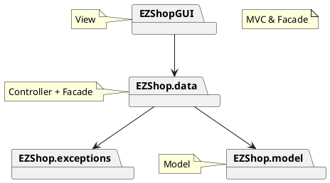

## Low level design

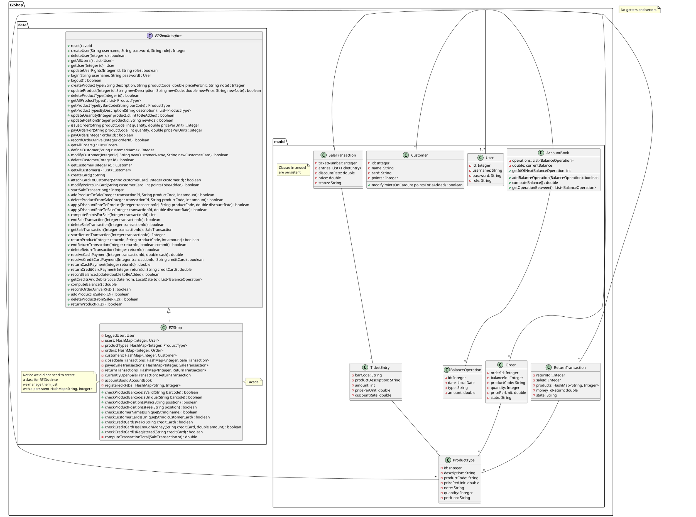

## Verification traceability matrix

<!--for each functional requirement from the requirement document, list which classes concur to implement it>-->

| FR ID | EZShop | User | ProductType | Order | Customer | SaleTransaction | ReturnTransaction | AccountBook | BalanceOperation | TicketEntry |
| :---: | :----: | :--: | :---------: | :---: | :------: | :-------------: | :---------------: | :---------: | :--------------: | :--------------: |
| FR1   | X      | X    |             |       |          |                 |                   |             |                  | <!-- FR1 Manage users and rights (users are Administrator, ShopManager, Cashier) -->
| FR3   | X      | X    | X           |       |          |                 |                   |             |                  |                  | <!-- FR3 Manage product catalog -->
| FR4   | X      | X    | X           | X     |          |                 |                   | X           | X                |                  | <!-- FR4 Manage inventory -->
| FR5   | X      | X    |             |       | X        |                 |                   |             |                  |                  | <!-- FR5 Manage customers and cards -->
| FR6   | X      | X    | X           |       | X        | X               | X                 | X           | X                | X                | <!-- FR6 Manage a sale transaction -->
| FR7   | X      | X    |             |       | X        | X               | X                 | X           | X                |                  | <!-- FR7 Manage payment -->
| FR8   | X      |      |             | X     | X        |                 |                   | X           | X                |                  | <!-- FR8 Accounting-->

## Verification sequence diagrams

### Use case 1, UC1 - Manage products

#### Scenario 1-1: Create product type X

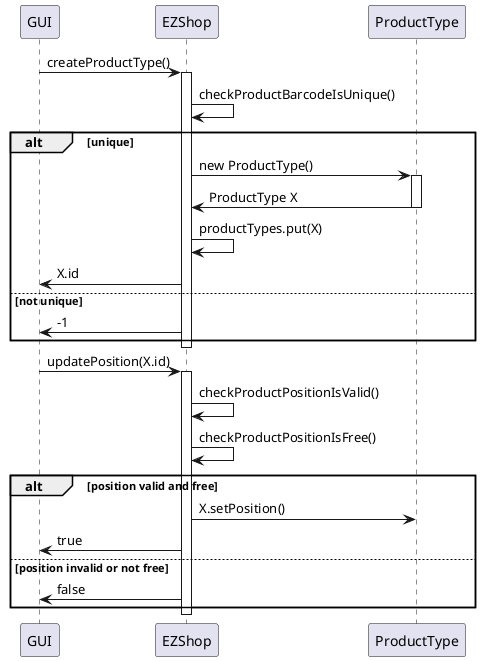

#### Scenario 1-3: Modify product type price per unit

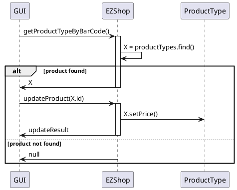

### Use case 2, UC2 - Manage users and rights

#### Scenario 2-3: Modify user rights of username X

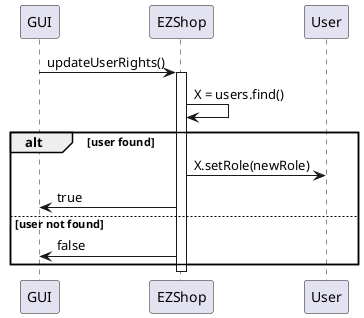

### Use case 3, UC3 - Manage inventory and orders

#### Scenarios 3-1, 3-2: Order of product type X issued (1) and paid (2)

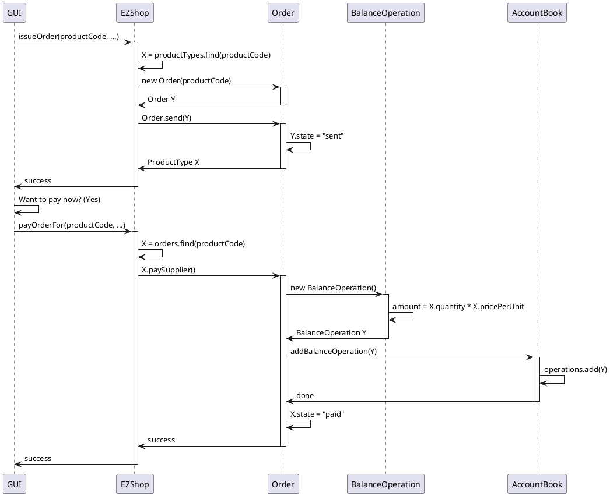

### Use case 4, UC4 - Manage Customers and  Cards

#### Scenarios 4-1, 4-2: Create customer record (1) and Attach Loyalty card (2)

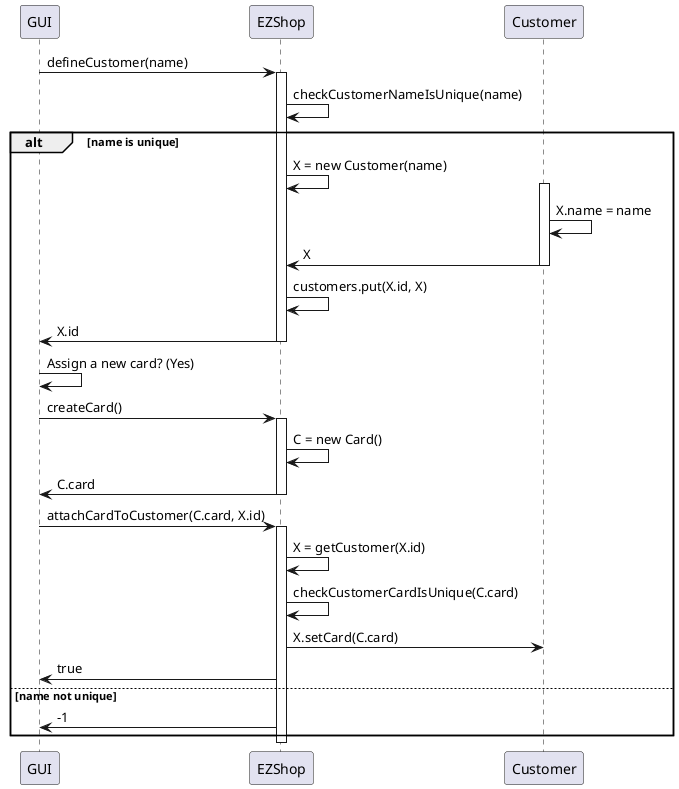

### Use case 5, UC5 - Authenticate, authorize

#### Scenario 5-1: Login

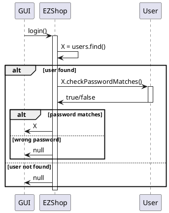

### Use case 6, UC6 - Manage sale transaction

#### Scenario 6-2: Sale of product type X with product discount

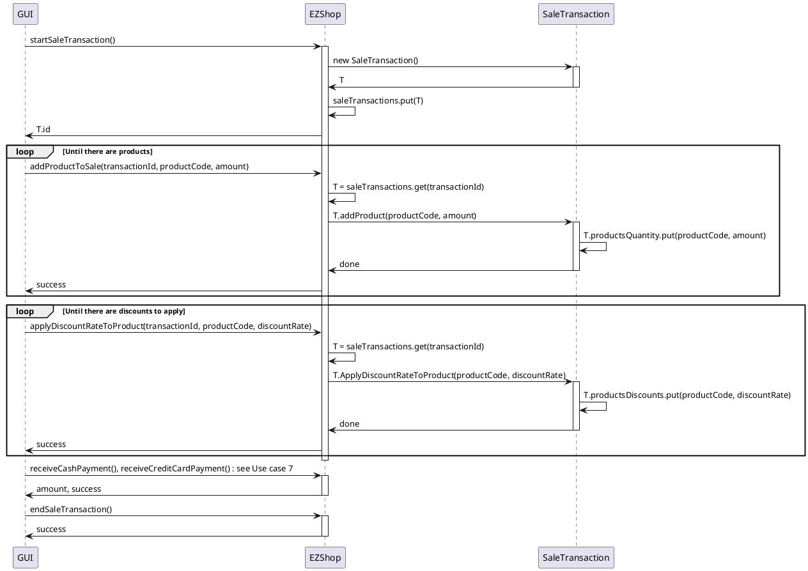

### Use case 7, UC7 - Manage payment

#### Scenario 7-1: Manage payment by valid credit card

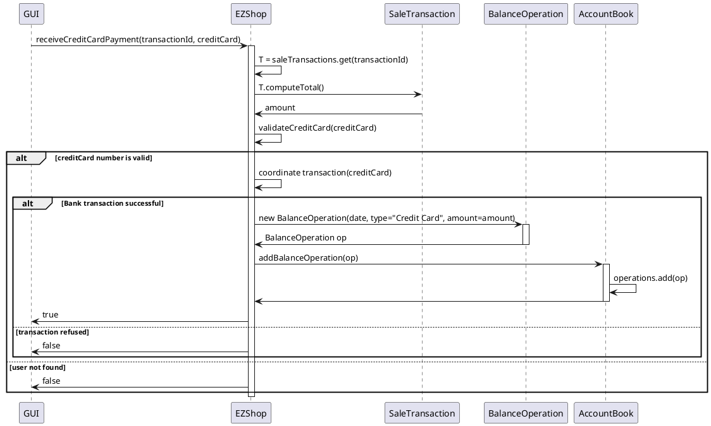

### Use case 8, UC8 - Manage return transaction

#### Scenario 8-2: Return transaction of product type X completed, cash

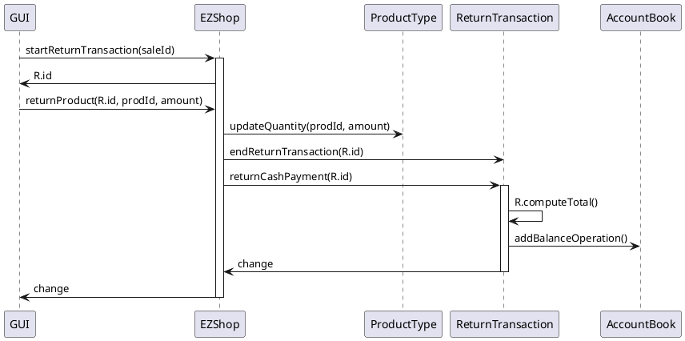

### Use case 9, UC9 - Accounting

#### Scenario 9-1: List credits and debits

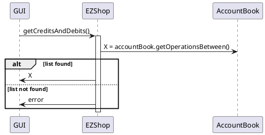
