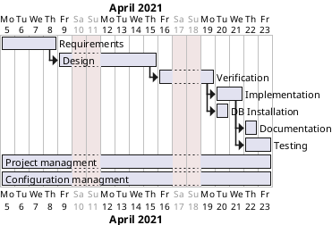

# Project Estimation

Authors: Alessio Santangelo, Andrea Cencio, Damiano Bonaccorsi, Lorenzo Chiola

Date: 29 April 2021

Version: 1.0

## Contents

- [Estimate by product decomposition]
- [Estimate by activity decomposition ]

## Estimation approach

Consider the EZShop  project as described in YOUR requirement document, assume that you are going to develop the project INDEPENDENT of the deadlines of the course

### Estimate by product decomposition

|       | Estimate |
| :---- | :------: |  
| NC    |   20     | <!-- Estimated number of classes to be developed -->
| A     |   160    | <!-- Estimated average size per class, in LOC -->
| S     |   3200   | <!-- Estimated size of project, in LOC (= NC * A) -->
| E     |   320    | <!-- Estimated effort, in person hours (here use productivity 10 LOC per person hour) -->
| C     |   9600   | <!-- Estimated cost, in euro (here use 1 person hour cost = 30 euro) -->
| Weeks |   3      | <!-- Estimated calendar time, in calendar weeks (Assume team of 4 people, 8 hours per day, 5 days per week ) -->

### Estimate by activity decomposition

|   Activity name           | Estimated effort (person hours) |
| :------------------------ | :-----------------------------: |
|   Requirements            |               40                |
|   Design                  |               64                |
|   Verification            |               32                |
|   Implementation          |               60                |
|   DB installation         |               4                 |
|   Documentation           |               24                |
|   Testing                 |               48                |
|   Project managment       |               24                |
|   Configuration managment |               16                |

#### Gantt chart

