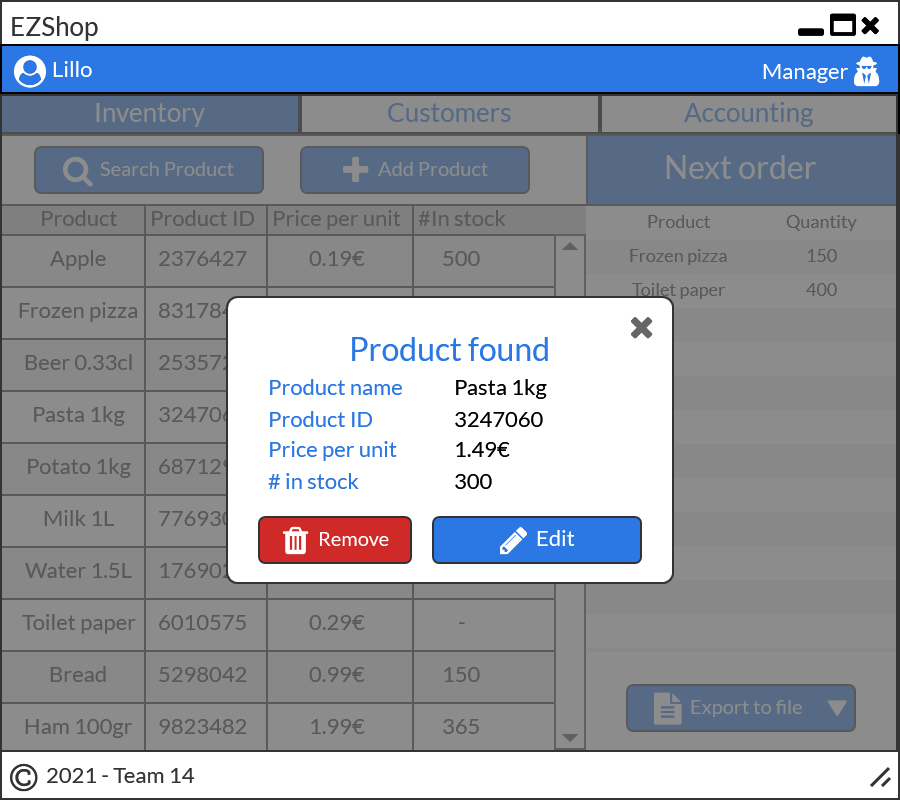

# Graphical User Interface Prototype  

Authors: Alessio Santangelo, Andrea Cencio, Damiano Bonaccorsi, Lorenzo Chiola

Date: 19 April 2021

Version: 1.1

## Use cases and scenario

### Use case 1, UC1 - Handle sales

#### Scenario 1.1

| Scenario 1.1 | Credit card payment |
| :------------- | :------------- |
| Precondition | Internet access, Cashier logged in |
| Post condition | Payment accepted, Inventory updated, Sales history updated, Receipt printed |
| Step #1 | Start sale transaction |
| Step #2 | Use barcode reader to retrieve the product’s code |
| Step #3 | Retrieve product information from the internal database |
| | Repeat 2 and 3 for all products in the cart |
| Step #4 | Compute total |
| |  |
| Step #5 | Select card payment |
| Step #6 | Send payment informations to the API and wait for response |
| |  |
| Step #7 | Check if the payment is successful |
| |  |
| Step #8 | Subtract quantity of product from stock if payment was successful  |
| Step #9 | Save sale information (date, quantity of products sold and total price) in the sales history |
| Step #10 | Print receipt |
| Step #11 | Close transaction |

#### Scenario 1.2

| Scenario 1.2   | Credit card payment |
| :------------- | :------------- |
| Precondition   | Internet access, Cashier logged in |
| Post condition | Payment refused |
| Step# | Description |
| 1     | Start sale transaction |  
| 2     | Use barcode reader to retrieve the product’s code |
| 3     | Retrieve product information from the internal database |
|       | Repeat 2 and 3 for all products in the cart |
| 4     | Compute total |
| |  |
| 5     | Select card payment |
| 6     | Send payment informations to the API and wait for response |
| |  |
| 7     | Payment refused |
| |  |
| 8     | Try again or return to sale screen |

#### Scenario 1.3

| Scenario 1.3   | Cash payment |
| :------------- | :----------- |
| Precondition   | Cashier logged in |
| Post condition | Payment accepted, Inventory updated, Sales history updated, Receipt printed |
| Step# | Description |
| 1     | Start sales transaction |
| 2     | Use barcode system to retrieve the product’s code |
| 3     | Retrieve product information from the internal database |
|       | Repeat 2 and 3 for all products in the cart |
| 4     | Compute total |
| |  |
| 5     | Select card payment |
| 6     | The cashier inputs the received cash amount to EZShop |
| 7     | EZShop communicates the change to the cashier |
| |  |
| 8     | Payment completed |
| 9     | Subtract quantity of product from stock |
| |  |
| 10    | Save sales information (quantity of products sold and total price) in the sales history |
| 11    | Print receipt |
| 12    | Close transaction |

### Use case 2, UC2 - Manage inventory

#### Scenario 2.1

| Scenario 2.1   | Add product info to the inventory |
| :------------- | :------------- |
| Precondition   | Product not already in inventory; Logged in as manager |
| Post condition | Product info inserted |
| Step#          | Description |
| 1              | Start adding procedure |
| |  |
| 2              | Scan barcode or insert product's code |
| |  |
| 3              | Insert product information (at least price and barcode) |
| |  |
| 4              | Confirm and conclude adding procedure |

#### Scenario 2.2

| Scenario 2.2   | Delete product info from the inventory |
| :------------- | :------------- |
| Precondition   | Barcode must be valid; Logged in as manager |
| Post condition | Product info deleted |
| Step#          | Description |
| 1              | Start searching procedure |
| |  |
| 2              | Scan barcode or insert product's code |
| |  |
| 3              | Click on Delete button |
| |  |
| 4              | Ask for deletion confirmation |
| |  |
| 5              | Finally delete the product info |

#### Scenario 2.3

| Scenario 2.3   | Edit quantity/info of product in inventory |
| :------------- | :------------- |
| Precondition   | Barcode must be valid; Logged in as manager |
| Post condition | Product info updated |
| Step#          | Description  |
| 1              | Start searching procedure |
| |  |
| 2              | Scan barcode or insert product's code |
| |  |
| 3              | Click on Edit button |
| |  |
| 4              | Enter new quantity/info |
| |  |
| 5              | Ask for edit confirmation |
| |  |
| 6              | Finally update the product info |

### Use case 3, UC3 - Manage customers

#### Scenario 3.1

| Scenario 3.1   | Insert new customer |
| :------------- | :------------- |
| Precondition   | Knowing customer informations, Logged in as manager |
| Post condition | Customer informations registered |
| Step#          | Description |
| 1              | Start adding procedure |
| |  |
| 2              | Insert customers information |
| |  |
| 3              | Confirm and conclude adding procedure |  

##### Scenario 3.2

| Scenario 3.2   | Edit customer info |
| :------------- | :------------- |
| Precondition   | Knowing customer informations, Logged in as manager |
| Post condition | Customer not found |
| Step#          | Description |
| 1              | Start searching procedure |
| |  |
| 2              | Insert search parameters |
| |  |
| 3              | Customer not found |
| |  |
| 4              | Add new customer or return to customers screen |  

### Use case 4, UC4 - Manage accounting

#### Scenario 4.1

| Scenario 4.1   | Compute balance based on sales and orders history |
| :------------- | :-------------|
| Precondition   | Having a proper sales and orders history, Logged in as Manager or Owner |
| Post condition | Balance displayed |
| Step#          | Description |
| 1              | Start computing balance procedure |
| |  |
| 2              | Ask the time period over which the balance has to be computed |
| |  |  
| 3              | Compute results |
| 4              | Display results |

### Use case 5, UC5 - User authentication

#### Scenario 5.1

| Scenario 5.1   | Logging in |
| :------------- | :-------------|
| Precondition   | Having an account (Either Manager, Owner or Cashier) |  
| Post condition | Logged in |
| Step#          | Description |
| 1              | Open the app |  
| 2              | Insert user and password |
| |  |
| 3              | Click the Login Button |

## Visualization of links between different screens

| Sales        |
| :------------: |
|   |

| Inventory    |
| :------------: |
|   |

| Customers   |
| :------------: |
|   |

| Accounting   |
| :------------: |
|   |
