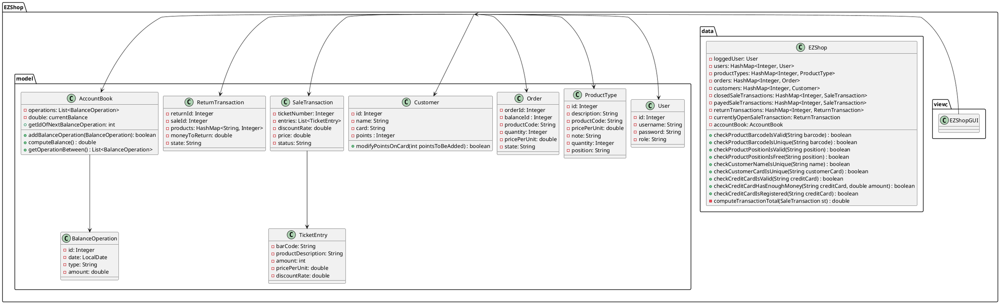

# Integration and API Test Documentation

Authors: Alessio Santangelo, Andrea Cencio, Damiano Bonaccorsi, Lorenzo Chiola

Date: 21 May 2021

Version: 1.3

# Contents

- [Dependency graph](#dependency graph)

- [Integration approach](#integration)

- [Tests](#tests)

- [Scenarios](#scenarios)

- [Coverage of scenarios and FR](#scenario-coverage)
- [Coverage of non-functional requirements](#nfr-coverage)

# Dependency graph 

# Integration approach

**Bottom-up approach:**

- step1: classes EZTicketEntry, EZBalanceOperation
- step2: classes AccountBook, ReturnTransaction, EZSaleTransaction, EZCustomer, EZOrder, EZProductType, EZUser
- step3: class EZShop (API testing)
- step4: EZShopGUI

#  Tests
## Step 1
| Classes  | JUnit test cases |
|----------|------------------|
| EZBalanceOperation | class: EZBalanceOperationSettersTest, method: testSetBalanceId |
| " | class: EZBalanceOperationSettersTest, method: testSetDate |
| " | class: EZBalanceOperationSettersTest, method: testSetMoney |
| " | class: EZBalanceOperationSettersTest, method: testSetType |
| class: EZTicketEntry | class: EZTicketEntrySettersTest, method: testSetBarCode |
| " | class: EZTicketEntrySettersTest, method: testSetProductDescription |
| " | class: EZTicketEntrySettersTest, method: testSetAmount |
| " | class: EZTicketEntrySettersTest, method: testSetPricePerUnit |
| " | class: EZTicketEntrySettersTest, method: testSetDiscountRate |

## Step 2
| Classes  | JUnit test cases |
|--|--|
| AccountBook | class: AccountBookIntegrationTests, method: getIdOfNextBalanceOperationTest |
| " | class: AccountBookIntegrationTests, method: testAddBalanceOperationInvalidType |
| " | class: AccountBookIntegrationTests, method: testAddBalanceOperationCreditType |
| " | class: AccountBookIntegrationTests, method: testAddBalanceOperationDebitType |
| " | class: AccountBookIntegrationTests, method: testGetOperationBetweenNullList |
| " | class: AccountBookIntegrationTests, method: testGetOperationBetweenNullFrom |
| " | class: AccountBookIntegrationTests, method: testGetOperationBetweenNullTo |
| " | class: AccountBookIntegrationTests, method: testGetOperationBetweenTwoDates |
| " | class: AccountBookIntegrationTests, method: testGetOperationBetweenTwoInvertedDates |
| ALL THE OTHER TESTS DEFINED IN "UnitTestReport.md" AND NOT LISTED ABOVE | - |

## Step 3 (API testing)

| Classes  | JUnit test cases |
|--|--|
| EZShop | class: EZShopUserMethodsTest, method: testCreateUserInvalidUsername |
| " | class: EZShopUserMethodsTest, method: testCreateUserInvalidPassword |
| " | class: EZShopUserMethodsTest, method: testCreateUserInvalidRole |
| " | class: EZShopUserMethodsTest, method: testCreateUserSuccess |
| " | class: EZShopUserMethodsTest, method: testCreateUserAlreadyExists |
| " | class: EZShopUserMethodsTest, method: testDeleteUserUnauthorized |
| " | class: EZShopUserMethodsTest, method: testDeleteUserInvalidId |
| " | class: EZShopUserMethodsTest, method: testDeleteUserIdDoesntExist |
| " | class: EZShopUserMethodsTest, method: testDeleteUserSuccess |
| " | class: EZShopUserMethodsTest, method: testGetAllUsersUnauthorized |
| " | class: EZShopUserMethodsTest, method: testGetAllUsersAuthorizedNotEmpty |
| " | class: EZShopUserMethodsTest, method: testGetAllUsersAuthorizedEmpty |
| " | class: EZShopUserMethodsTest, method: testGetUserUnauthorizedNotLogged |
| " | class: EZShopUserMethodsTest, method: testGetUserUnauthorizedLoggedAsCashier |
| " | class: EZShopUserMethodsTest, method: testGetUserUnauthorizedLoggedAsManager |
| " | class: EZShopUserMethodsTest, method: testGetUserAuthorizedInvalidNullId |
| " | class: EZShopUserMethodsTest, method: testGetUserAuthorizedInvalidNegativeId |
| " | class: EZShopUserMethodsTest, method: testGetUserAuthorizedNotExists |
| " | class: EZShopUserMethodsTest, method: testGetUserAuthorizedExists |
| " | class: EZShopUserMethodsTest, method: testUpdateUserRightsUnauthorizedNotLogged |
| " | class: EZShopUserMethodsTest, method: testUpdateUserRightsUnauthorizedLoggedAsCashier |
| " | class: EZShopUserMethodsTest, method: testUpdateUserRightsUnauthorizedLoggedAsManager |
| " | class: EZShopUserMethodsTest, method: testUpdateUserRightsAuthorizedInvalidNullId |
| " | class: EZShopUserMethodsTest, method: testUpdateUserRightsAuthorizedInvalidNegativeId |
| " | class: EZShopUserMethodsTest, method: testUpdateUserRightsAuthorizedInvalidRole |
| " | class: EZShopUserMethodsTest, method: testUpdateUserRightsAuthorizedNotExists |
| " | class: EZShopUserMethodsTest, method: testUpdateUserRightsAuthorizedExists |
| " | class: EZShopUserMethodsTest, method: testLoginInvalidNullUsername |
| " | class: EZShopUserMethodsTest, method: testLoginInvalidEmptyUsername |
| " | class: EZShopUserMethodsTest, method: testLoginInvalidNullPassword |
| " | class: EZShopUserMethodsTest, method: testLoginInvalidEmptyPassword |
| " | class: EZShopUserMethodsTest, method: testLoginCredentialsNotCorrect |
| " | class: EZShopUserMethodsTest, method: testLoginCredentialsCorrect |
| " | class: EZShopUserMethodsTest, method: testLogoutNoLoggedUser |
| " | class: EZShopUserMethodsTest, method: testLogoutLoggedUser |
| " | class: EZShopProductTypesMethodsTest, method: testCreateProductTypeInvalidNullDescription |
| " | class: EZShopProductTypesMethodsTest, method: testCreateProductTypeInvalidEmptyDescription |
| " | class: EZShopProductTypesMethodsTest, method: testCreateProductTypeInvalidPricePerUnit |
| " | class: EZShopProductTypesMethodsTest, method: testCreateProductTypeUnauthorizedNotLogged |
| " | class: EZShopProductTypesMethodsTest, method: testCreateProductTypeUnauthorizedLoggedAsCashier |
| " | class: EZShopProductTypesMethodsTest, method: testCreateProductTypeBarcodeNotUnique |
| " | class: EZShopProductTypesMethodsTest, method: testCreateProductTypeSuccess |
| " | class: EZShopProductTypesMethodsTest, method: testUpdateProductInvalidNullId |
| " | class: EZShopProductTypesMethodsTest, method: testUpdateProductInvalidNegativeId |
| " | class: EZShopProductTypesMethodsTest, method: testUpdateProductInvalidNullDescription |
| " | class: EZShopProductTypesMethodsTest, method: testUpdateProductInvalidEmptyDescription |
| " | class: EZShopProductTypesMethodsTest, method: testUpdateProductInvalidPricePerUnit |
| " | class: EZShopProductTypesMethodsTest, method: testUpdateProductUnauthorizedNotLogged |
| " | class: EZShopProductTypesMethodsTest, method: testUpdateProductUnauthorizedLoggedAsCashier |
| " | class: EZShopProductTypesMethodsTest, method: testUpdateProductNotExists |
| " | class: EZShopProductTypesMethodsTest, method: testUpdateProductBarcodeNotUnique |
| " | class: EZShopProductTypesMethodsTest, method: testUpdateProductSuccess |
| " | class: EZShopProductTypesMethodsTest, method: testDeleteProductTypeInvalidNullId |
| " | class: EZShopProductTypesMethodsTest, method: testDeleteProductTypeInvalidNegativeId |
| " | class: EZShopProductTypesMethodsTest, method: testDeleteProductTypeUnauthorizedNotLogged |
| " | class: EZShopProductTypesMethodsTest, method: testDeleteProductTypeUnauthorizedLoggedAsCashier |
| " | class: EZShopProductTypesMethodsTest, method: testDeleteProductTypeNotExists |
| " | class: EZShopProductTypesMethodsTest, method: testDeleteProductTypeSuccess |
| " | class: EZShopProductTypesMethodsTest, method: testGetAllProductTypesUnauthorizedNotLogged |
| " | class: EZShopProductTypesMethodsTest, method: testGetAllProductTypesEmpty |
| " | class: EZShopProductTypesMethodsTest, method: testGetAllProductTypesNotEmpty |
| " | class: EZShopProductTypesMethodsTest, method: testGetProductTypeByBarCodeUnauthorizedNotLogged |
| " | class: EZShopProductTypesMethodsTest, method: testGetProductTypeByBarCodeUnauthorizedLoggedAsCashier |
| " | class: EZShopProductTypesMethodsTest, method: testGetProductTypeByBarCodeNotExists |
| " | class: EZShopProductTypesMethodsTest, method: testGetProductTypeByBarCodeNotValid |
| " | class: EZShopProductTypesMethodsTest, method: testGetProductTypeByBarCodeExists |
| " | class: EZShopProductTypesMethodsTest, method: testGetProductTypesByDescriptionUnauthorizedNotLogged |
| " | class: EZShopProductTypesMethodsTest, method: testGetProductTypesByDescriptionUnauthorizedLoggedAsCashier |
| " | class: EZShopProductTypesMethodsTest, method: testGetProductTypesByDescriptionNoProductsNoFilter |
| " | class: EZShopProductTypesMethodsTest, method: testGetProductTypesByDescriptionSomeProductsNoFilter |
| " | class: EZShopProductTypesMethodsTest, method: testGetProductTypesByDescriptionSomeProductsFilter |
| " | class: EZShopProductTypesMethodsTest, method: testUpdateQuantityInvalidNullId |
| " | class: EZShopProductTypesMethodsTest, method: testUpdateQuantityInvalidNegativeId |
| " | class: EZShopProductTypesMethodsTest, method: testUpdateQuantityUnauthorizedNotLogged |
| " | class: EZShopProductTypesMethodsTest, method: testUpdateQuantityUnauthorizedLoggedAsCashier |
| " | class: EZShopProductTypesMethodsTest, method: testUpdateQuantityNotExists |
| " | class: EZShopProductTypesMethodsTest, method: testUpdateQuantityNegative |
| " | class: EZShopProductTypesMethodsTest, method: testUpdateQuantityNoLocation |
| " | class: EZShopProductTypesMethodsTest, method: testUpdateQuantity |
| " | class: EZShopProductTypesMethodsTest, method: testUpdatePositionInvalidNullId |
| " | class: EZShopProductTypesMethodsTest, method: testUpdatePositionInvalidNegativeId |
| " | class: EZShopProductTypesMethodsTest, method: testUpdatePositionUnauthorizedNotLogged |
| " | class: EZShopProductTypesMethodsTest, method: testUpdatePositionUnauthorizedLoggedAsCashier |
| " | class: EZShopProductTypesMethodsTest, method: testUpdatePositionProductNotExists |
| " | class: EZShopProductTypesMethodsTest, method: testUpdatePositionNotFree |
| " | class: EZShopProductTypesMethodsTest, method: testUpdatePositionNotValid |
| " | class: EZShopProductTypesMethodsTest, method: testUpdatePositionResetNull |
| " | class: EZShopProductTypesMethodsTest, method: testUpdatePositionResetEmpty |
| " | class: EZShopProductTypesMethodsTest, method: testUpdatePosition |
| " | class: EZShopOrderMethodsTest, method: testissueOrderUnauthorizedNotLogged |
| " | class: EZShopOrderMethodsTest, method: testissueOrderUnauthorizedLoggedAsCashier |
| " | class: EZShopOrderMethodsTest, method: testIssureOrderInvalidQuantity |
| " | class: EZShopOrderMethodsTest, method: testIssueOrderInvalidBarcode |
| " | class: EZShopOrderMethodsTest, method: testIssueOrderInvalidPricePerUnit |
| " | class: EZShopOrderMethodsTest, method: testIssueOrderNotExists |
| " | class: EZShopOrderMethodsTest, method: testIssueOrderSuccess |
| " | class: EZShopOrderMethodsTest, method: testpayOrderForUnauthorizedNotLogged |
| " | class: EZShopOrderMethodsTest, method: testpayOrderForUnauthorizedLoggedAsCashier |
| " | class: EZShopOrderMethodsTest, method: testpayOrderForInvalidQuantity |
| " | class: EZShopOrderMethodsTest, method: testpayOrderForInvalidPricePerUnit |
| " | class: EZShopOrderMethodsTest, method: testpayOrderForNotExists |
| " | class: EZShopOrderMethodsTest, method: testpayOrderForNotEnoughBalance |
| " | class: EZShopOrderMethodsTest, method: testpayOrderForSuccess |
| " | class: EZShopOrderMethodsTest, method: testpayOrderUnauthorizedNotLogged |
| " | class: EZShopOrderMethodsTest, method: testpayOrderUnauthorizedLoggedAsCashier |
| " | class: EZShopOrderMethodsTest, method: testpayOrderInvalidNullId |
| " | class: EZShopOrderMethodsTest, method: testpayOrderInvalidNegativeId |
| " | class: EZShopOrderMethodsTest, method: testpayOrderNotExists |
| " | class: EZShopOrderMethodsTest, method: testpayOrderNotEnoughBalance |
| " | class: EZShopOrderMethodsTest, method: testpayOrderSuccess |
| " | class: EZShopOrderMethodsTest, method: testpayOrderForSuccessMultiple |
| " | class: EZShopOrderMethodsTest, method: testpayOrderAlreadyPayed |
| " | class: EZShopOrderMethodsTest, method: testrecordOrderArrivalUnauthorizedNotLogged |
| " | class: EZShopOrderMethodsTest, method: testrecordOrderArrivalUnauthorizedLoggedAsCashier |
| " | class: EZShopOrderMethodsTest, method: testrecordOrderArrivalInvalidNullId |
| " | class: EZShopOrderMethodsTest, method: testrecordOrderArrivalInvalidNegativeId |
| " | class: EZShopOrderMethodsTest, method: testrecordOrderArrivalNotExists |
| " | class: EZShopOrderMethodsTest, method: testrecordOrderArrivalExistsNoLocation |
| " | class: EZShopOrderMethodsTest, method: testrecordOrderArrivalAlreadyCompleted |
| " | class: EZShopOrderMethodsTest, method: testrecordOrderArrivalSuccess |
| " | class: EZShopOrderMethodsTest, method: testgetAllOrdersUnauthorizedNotLogged |
| " | class: EZShopOrderMethodsTest, method: testgetAllOrdersUnauthorizedLoggedAsCashier |
| " | class: EZShopOrderMethodsTest, method: testgetAllOrdersEmpty |
| " | class: EZShopOrderMethodsTest, method: testgetAllOrdersNotEmpty |
| " | class: EZShopCustomerMethodsTest, method: testdefineCustomerUnauthorizedNotLogged |
| " | class: EZShopCustomerMethodsTest, method: testdefineCustomerInvalidNullName |
| " | class: EZShopCustomerMethodsTest, method: testdefineCustomerInvalidEmptyName |
| " | class: EZShopCustomerMethodsTest, method: testdefineCustomerNameNotUnique |
| " | class: EZShopCustomerMethodsTest, method: testdefineCustomerSuccess |
| " | class: EZShopCustomerMethodsTest, method: testmodifyCustomerUnauthorizedNotLogged |
| " | class: EZShopCustomerMethodsTest, method: testmodifyCustomerInvalidNullName |
| " | class: EZShopCustomerMethodsTest, method: testmodifyCustomerInvalidEmptyName |
| " | class: EZShopCustomerMethodsTest, method: testmodifyCustomerInvalidShortCard |
| " | class: EZShopCustomerMethodsTest, method: testmodifyCustomerInvalidLongCard |
| " | class: EZShopCustomerMethodsTest, method: testmodifyCustomerInvalidAlphabeticCard |
| " | class: EZShopCustomerMethodsTest, method: testmodifyCustomerInvalidNullId |
| " | class: EZShopCustomerMethodsTest, method: testmodifyCustomerInvalidNegativeId |
| " | class: EZShopCustomerMethodsTest, method: testmodifyCustomerNameNotUnique |
| " | class: EZShopCustomerMethodsTest, method: testmodifyCustomerCardNotUnique |
| " | class: EZShopCustomerMethodsTest, method: testmodifyCustomerNotExists |
| " | class: EZShopCustomerMethodsTest, method: testmodifyCustomerSuccessAsAdmin |
| " | class: EZShopCustomerMethodsTest, method: testmodifyCustomerSuccessAsCashier |
| " | class: EZShopCustomerMethodsTest, method: testmodifyCustomerSuccessAsManager |
| " | class: EZShopCustomerMethodsTest, method: testdeleteCustomerUnauthorizedNotLogged |
| " | class: EZShopCustomerMethodsTest, method: testdeleteCustomerInvalidNullId |
| " | class: EZShopCustomerMethodsTest, method: testdeleteCustomerInvalidNegativeId |
| " | class: EZShopCustomerMethodsTest, method: testdeleteCustomerNotExists |
| " | class: EZShopCustomerMethodsTest, method: testdeleteCustomerSuccessAsAdmin |
| " | class: EZShopCustomerMethodsTest, method: testdeleteCustomerSuccessAsCashier |
| " | class: EZShopCustomerMethodsTest, method: testdeleteCustomerSuccessAsManager |
| " | class: EZShopCustomerMethodsTest, method: testgetCustomerUnauthorizedNotLogged |
| " | class: EZShopCustomerMethodsTest, method: testgetCustomerInvalidNullId |
| " | class: EZShopCustomerMethodsTest, method: testgetCustomerInvalidNegativeId |
| " | class: EZShopCustomerMethodsTest, method: testgetCustomerNotExists |
| " | class: EZShopCustomerMethodsTest, method: testgetCustomerSuccessAsAdmin |
| " | class: EZShopCustomerMethodsTest, method: testgetCustomerSuccessAsCashier |
| " | class: EZShopCustomerMethodsTest, method: testgetCustomerSuccessAsManager |
| " | class: EZShopCustomerMethodsTest, method: testgetAllCustomersUnauthorizedNotLogged |
| " | class: EZShopCustomerMethodsTest, method: testgetAllCustomersLoggedAsCashier |
| " | class: EZShopCustomerMethodsTest, method: testgetAllCustomersLoggedAsManager |
| " | class: EZShopCustomerMethodsTest, method: testgetAllCustomersLoggedAsAdmin |
| " | class: EZShopCustomerMethodsTest, method: testgetAllCustomersNotEmpty |
| " | class: EZShopCustomerMethodsTest, method: testcreateCardUnauthorizedNotLogged |
| " | class: EZShopCustomerMethodsTest, method: testcreateCardAsCashier |
| " | class: EZShopCustomerMethodsTest, method: testcreateCardAsManager |
| " | class: EZShopCustomerMethodsTest, method: testattachCardToCustomerUnauthorizedNotLogged |
| " | class: EZShopCustomerMethodsTest, method: testattachCardToCustomerInvalidNullId |
| " | class: EZShopCustomerMethodsTest, method: testattachCardToCustomerInvalidNegativeId |
| " | class: EZShopCustomerMethodsTest, method: testattachCardToCustomerInvalidNullCard |
| " | class: EZShopCustomerMethodsTest, method: testattachCardToCustomerInvalidEmptyCard |
| " | class: EZShopCustomerMethodsTest, method: testattachCardToCustomerInvalidAlphabeticCard |
| " | class: EZShopCustomerMethodsTest, method: testattachCardToCustomerNotExists |
| " | class: EZShopCustomerMethodsTest, method: testattachCardToCustomerNotUnique |
| " | class: EZShopCustomerMethodsTest, method: testattachCardToCustomerSuccessAsCashier |
| " | class: EZShopCustomerMethodsTest, method: testattachCardToCustomerSuccessAsManager |
| " | class: EZShopCustomerMethodsTest, method: testmodifyPointsOnCardSuccessAsCashier |
| " | class: EZShopCustomerMethodsTest, method: testmodifyPointsOnCardSuccessAsManager |
| " | class: EZShopSaleTransactionMethodsTest, method: test_startSaleTransaction_01_unauthUser |
| " | class: EZShopSaleTransactionMethodsTest, method: test_startSaleTransaction_02_validUser |
| " | class: EZShopSaleTransactionMethodsTest, method: test_startSaleTransaction_03_twoSales |
| " | class: EZShopSaleTransactionMethodsTest, method: test_addProductToSale_01_unauthUser |
| " | class: EZShopSaleTransactionMethodsTest, method: test_addProductToSale_02_nullTransaction |
| " | class: EZShopSaleTransactionMethodsTest, method: test_addProductToSale_03_invalidTransaction |
| " | class: EZShopSaleTransactionMethodsTest, method: test_addProductToSale_04_inexistentTransaction |
| " | class: EZShopSaleTransactionMethodsTest, method: test_addProductToSale_05_nullProduct |
| " | class: EZShopSaleTransactionMethodsTest, method: test_addProductToSale_06_emptyProduct |
| " | class: EZShopSaleTransactionMethodsTest, method: test_addProductToSale_07_invalidProduct |
| " | class: EZShopSaleTransactionMethodsTest, method: test_addProductToSale_08_nonexistentProduct |
| " | class: EZShopSaleTransactionMethodsTest, method: test_addProductToSale_09_invalidQuantity |
| " | class: EZShopSaleTransactionMethodsTest, method: test_addProductToSale_10_tooBigQuantity |
| " | class: EZShopSaleTransactionMethodsTest, method: test_addProductToSale_11_successful |
| " | class: EZShopSaleTransactionMethodsTest, method: test_removeProductFromSale_01_unauthUser |
| " | class: EZShopSaleTransactionMethodsTest, method: test_removeProductFromSale_02_nullTransaction |
| " | class: EZShopSaleTransactionMethodsTest, method: test_removeProductFromSale_03_invalidTransaction |
| " | class: EZShopSaleTransactionMethodsTest, method: test_removeProductFromSale_04_inexistentTransaction |
| " | class: EZShopSaleTransactionMethodsTest, method: test_removeProductFromSale_05_nullProduct |
| " | class: EZShopSaleTransactionMethodsTest, method: test_removeProductFromSale_06_emptyProduct |
| " | class: EZShopSaleTransactionMethodsTest, method: test_removeProductFromSale_07_invalidProduct |
| " | class: EZShopSaleTransactionMethodsTest, method: test_removeProductFromSale_08_nonexistentProduct |
| " | class: EZShopSaleTransactionMethodsTest, method: test_removeProductFromSale_09_invalidQuantity |
| " | class: EZShopSaleTransactionMethodsTest, method: test_removeProductFromSale_10_tooBigQuantity |
| " | class: EZShopSaleTransactionMethodsTest, method: test_removeProductFromSale_11_successful |
| " | class: EZShopSaleTransactionMethodsTest, method: test_applyDiscountRateToProduct_01_unauthUser |
| " | class: EZShopSaleTransactionMethodsTest, method: test_applyDiscountRateToProduct_02_nullTransaction |
| " | class: EZShopSaleTransactionMethodsTest, method: test_applyDiscountRateToProduct_03_invalidTransaction |
| " | class: EZShopSaleTransactionMethodsTest, method: test_applyDiscountRateToProduct_04_inexistentTransaction |
| " | class: EZShopSaleTransactionMethodsTest, method: test_applyDiscountRateToProduct_05_nullProduct |
| " | class: EZShopSaleTransactionMethodsTest, method: test_applyDiscountRateToProduct_06_emptyProduct |
| " | class: EZShopSaleTransactionMethodsTest, method: test_applyDiscountRateToProduct_07_invalidProduct |
| " | class: EZShopSaleTransactionMethodsTest, method: test_applyDiscountRateToProduct_08_nonexistentProduct |
| " | class: EZShopSaleTransactionMethodsTest, method: test_applyDiscountRateToProduct_09_invalidDiscountRate |
| " | class: EZShopSaleTransactionMethodsTest, method: test_applyDiscountRateToProduct_10_successful |
| " | class: EZShopSaleTransactionMethodsTest, method: test_applyDiscountRateToSale_01_unauthUser |
| " | class: EZShopSaleTransactionMethodsTest, method: test_applyDiscountRateToSale_02_nullTransaction |
| " | class: EZShopSaleTransactionMethodsTest, method: test_applyDiscountRateToSale_03_invalidTransaction |
| " | class: EZShopSaleTransactionMethodsTest, method: test_applyDiscountRateToSale_04_inexistentTransaction |
| " | class: EZShopSaleTransactionMethodsTest, method: test_applyDiscountRateToSale_05_invalidDiscountRate |
| " | class: EZShopSaleTransactionMethodsTest, method: test_applyDiscountRateToSale_06_successful |
| " | class: EZShopSaleTransactionMethodsTest, method: test_applyDiscountRateToSale_07_closed_successful |
| " | class: EZShopSaleTransactionMethodsTest, method: test_computePointsForSale_01_unauthUser |
| " | class: EZShopSaleTransactionMethodsTest, method: test_computePointsForSale_02_nullTransaction |
| " | class: EZShopSaleTransactionMethodsTest, method: test_computePointsForSale_03_invalidTransaction |
| " | class: EZShopSaleTransactionMethodsTest, method: test_computePointsForSale_04_inexistentTransaction |
| " | class: EZShopSaleTransactionMethodsTest, method: test_computePointsForSale_05_success |
| " | class: EZShopSaleTransactionMethodsTest, method: test_computePointsForSale_06_okClosedTransaction |
| " | class: EZShopSaleTransactionMethodsTest, method: test_computePointsForSale_06_okPayedTransaction |
| " | class: EZShopSaleTransactionMethodsTest, method: test_deleteSaleTransaction_01_unauthUser |
| " | class: EZShopSaleTransactionMethodsTest, method: test_deleteSaleTransaction_02_nullTransaction |
| " | class: EZShopSaleTransactionMethodsTest, method: test_deleteSaleTransaction_03_invalidTransaction |
| " | class: EZShopSaleTransactionMethodsTest, method: test_deleteSaleTransaction_04_inexistentTransaction |
| " | class: EZShopSaleTransactionMethodsTest, method: test_deleteSaleTransaction_05_openDelete TODO fail |
| " | class: EZShopSaleTransactionMethodsTest, method: test_deleteSaleTransaction_06_closedDelete |
| " | class: EZShopSaleTransactionMethodsTest, method: test_deleteSaleTransaction_07_paidDelete TODO fail |
| " | class: EZShopSaleTransactionMethodsTest, method: test_getSaleTransaction_01_unauthUser |
| " | class: EZShopSaleTransactionMethodsTest, method: test_getSaleTransaction_02_nullTransaction |
| " | class: EZShopSaleTransactionMethodsTest, method: test_getSaleTransaction_03_invalidTransaction |
| " | class: EZShopSaleTransactionMethodsTest, method: test_getSaleTransaction_04_inexistentTransaction |
| " | class: EZShopSaleTransactionMethodsTest, method: test_getSaleTransaction_05_openGet |
| " | class: EZShopSaleTransactionMethodsTest, method: test_getSaleTransaction_06_closedGet |
| " | class: EZShopSaleTransactionMethodsTest, method: test_getSaleTransaction_07_paidGet |
| " | class: EZShopSaleTransactionMethodsTest, method: test_endSaleTransaction_01_unauthUser |
| " | class: EZShopSaleTransactionMethodsTest, method: test_endSaleTransaction_02_nullTransaction |
| " | class: EZShopSaleTransactionMethodsTest, method: test_endSaleTransaction_03_invalidTransaction |
| " | class: EZShopSaleTransactionMethodsTest, method: test_endSaleTransaction_04_inexistentTransaction |
| " | class: EZShopSaleTransactionMethodsTest, method: test_endSaleTransaction_05_success |
| " | class: EZShopSaleTransactionMethodsTest, method: test_receiveCashPayment_01_InvalidNullId |
| " | class: EZShopSaleTransactionMethodsTest, method: test_receiveCashPayment_02_InvalidNegativeId |
| " | class: EZShopSaleTransactionMethodsTest, method: test_receiveCashPayment_03_InvalidCash |
| " | class: EZShopSaleTransactionMethodsTest, method: test_receiveCashPayment_04_UnauthorizedNotLogged |
| " | class: EZShopSaleTransactionMethodsTest, method: test_receiveCashPayment_05_TransactionNotExists |
| " | class: EZShopSaleTransactionMethodsTest, method: test_receiveCashPayment_06_CashNotEnough |
| " | class: EZShopSaleTransactionMethodsTest, method: test_receiveCashPayment_07_Success |
| " | class: EZShopSaleTransactionMethodsTest, method: test_receiveCreditCardPayment_01_InvalidNullId |
| " | class: EZShopSaleTransactionMethodsTest, method: test_receiveCreditCardPayment_02_InvalidNegativeId |
| " | class: EZShopSaleTransactionMethodsTest, method: test_receiveCreditCardPayment_03_InvalidNullCreditCard |
| " | class: EZShopSaleTransactionMethodsTest, method: test_receiveCreditCardPayment_04_InvalidEmptyCreditCard |
| " | class: EZShopSaleTransactionMethodsTest, method: test_receiveCreditCardPayment_05_InvalidAlphaCreditCard |
| " | class: EZShopSaleTransactionMethodsTest, method: test_receiveCreditCardPayment_06_UnauthorizedNotLogged |
| " | class: EZShopSaleTransactionMethodsTest, method: test_receiveCreditCardPayment_07_TransactionNotExists |
| " | class: EZShopSaleTransactionMethodsTest, method: test_receiveCreditCardPayment_08_CreditCardNotRegistered |
| " | class: EZShopSaleTransactionMethodsTest, method: test_receiveCreditCardPayment_08_CreditCardNotEnoughMoney |
| " | class: EZShopSaleTransactionMethodsTest, method: test_receiveCreditCardPayment_09_Success |
| " | class: EZShopReturnTransactionMethodsTest, method: test_startReturnTransaction_01_unauthUser |
| " | class: EZShopReturnTransactionMethodsTest, method: test_startReturnTransaction_02_nullTransaction |
| " | class: EZShopReturnTransactionMethodsTest, method: test_startReturnTransaction_03_invalidTransaction |
| " | class: EZShopReturnTransactionMethodsTest, method: test_startReturnTransaction_04_inexistentTransaction |
| " | class: EZShopReturnTransactionMethodsTest, method: test_startReturnTransaction_05_success |
| " | class: EZShopReturnTransactionMethodsTest, method: test_returnProduct_01_unauthUser |
| " | class: EZShopReturnTransactionMethodsTest, method: test_returnProduct_02_nullTransaction |
| " | class: EZShopReturnTransactionMethodsTest, method: test_returnProduct_03_invalidTransaction |
| " | class: EZShopReturnTransactionMethodsTest, method: test_returnProduct_04_inexistentTransaction |
| " | class: EZShopReturnTransactionMethodsTest, method: test_returnProduct_05_nullProduct |
| " | class: EZShopReturnTransactionMethodsTest, method: test_returnProduct_06_emptyProduct |
| " | class: EZShopReturnTransactionMethodsTest, method: test_returnProduct_07_invalidProduct |
| " | class: EZShopReturnTransactionMethodsTest, method: test_returnProduct_08_nonexistentProduct |
| " | class: EZShopReturnTransactionMethodsTest, method: test_returnProduct_09_productNotInSale |
| " | class: EZShopReturnTransactionMethodsTest, method: test_returnProduct_10_invalidQuantity |
| " | class: EZShopReturnTransactionMethodsTest, method: test_returnProduct_11_tooBigQuantity |
| " | class: EZShopReturnTransactionMethodsTest, method: test_returnProduct_12_successful |
| " | class: EZShopReturnTransactionMethodsTest, method: test_endReturnTransaction_01_unauthUser |
| " | class: EZShopReturnTransactionMethodsTest, method: test_endReturnTransaction_02_nullTransaction |
| " | class: EZShopReturnTransactionMethodsTest, method: test_endReturnTransaction_03_invalidTransaction |
| " | class: EZShopReturnTransactionMethodsTest, method: test_endReturnTransaction_04_inexistentTransaction |
| " | class: EZShopReturnTransactionMethodsTest, method: test_endReturnTransaction_05_rollback |
| " | class: EZShopReturnTransactionMethodsTest, method: test_endReturnTransaction_06_commit |
| " | class: EZShopReturnTransactionMethodsTest, method: test_deleteReturnTransaction_01_unauthUser |
| " | class: EZShopReturnTransactionMethodsTest, method: test_deleteReturnTransaction_02_nullTransaction |
| " | class: EZShopReturnTransactionMethodsTest, method: test_deleteReturnTransaction_03_invalidTransaction |
| " | class: EZShopReturnTransactionMethodsTest, method: test_deleteReturnTransaction_04_inexistentTransaction |
| " | class: EZShopReturnTransactionMethodsTest, method: test_deleteReturnTransaction_05_openFail |
| " | class: EZShopReturnTransactionMethodsTest, method: test_deleteReturnTransaction_06_rolledBackFail |
| " | class: EZShopReturnTransactionMethodsTest, method: test_deleteReturnTransaction_07_committedSuccess |
| " | class: EZShopReturnTransactionMethodsTest, method: test_deleteReturnTransaction_08_paidBackFail |
| " | class: EZShopReturnTransactionMethodsTest, method: testReturnCashPaymentInvalidNullReturnId |
| " | class: EZShopReturnTransactionMethodsTest, method: testReturnCashPaymentInvalidReturnId |
| " | class: EZShopReturnTransactionMethodsTest, method: testReturnCashPaymentUnauthorized |
| " | class: EZShopReturnTransactionMethodsTest, method: testReturnCashPaymentNotExistingReturnTransaction |
| " | class: EZShopReturnTransactionMethodsTest, method: testReturnCashPaymentSuccess |
| " | class: EZShopAccountingMethodsTest, method: testRecordBalanceUpdateUnauthorizedNotLogged |
| " | class: EZShopAccountingMethodsTest, method: testRecordBalanceUpdateUnauthorizedLoggedAsCashier |
| " | class: EZShopAccountingMethodsTest, method: testRecordBalanceUpdateNegativeBalance |
| " | class: EZShopAccountingMethodsTest, method: testRecordBalanceUpdateCredit |
| " | class: EZShopAccountingMethodsTest, method: testRecordBalanceUpdateDebit |
| " | class: EZShopAccountingMethodsTest, method: testGetCreditsAndDebitsUnauthorizedNotLogged |
| " | class: EZShopAccountingMethodsTest, method: testGetCreditsAndDebitsUnauthorizedLoggedAsCashier |
| " | class: EZShopAccountingMethodsTest, method: testGetCreditsAndDebitsSuccess |
| " | class: EZShopAccountingMethodsTest, method: testComputeBalanceUnauthorizedNotLogged |
| " | class: EZShopAccountingMethodsTest, method: testComputeBalanceUnauthorizedLoggedAsCashier |
| " | class: EZShopAccountingMethodsTest, method: testComputeBalanceSuccess |
| " | class: EZShopRFIDSaleTransactionMethodsTest, method: test_addProductToSaleRFID_01_unauthUser |
| " | class: EZShopRFIDSaleTransactionMethodsTest, method: test_addProductToSaleRFID_02_nullTransaction |
| " | class: EZShopRFIDSaleTransactionMethodsTest, method: test_addProductToSaleRFID_03_invalidTransaction |
| " | class: EZShopRFIDSaleTransactionMethodsTest, method: test_addProductToSaleRFID_04_inexistentTransaction |
| " | class: EZShopRFIDSaleTransactionMethodsTest, method: test_addProductToSaleRFID_05_nullRFID |
| " | class: EZShopRFIDSaleTransactionMethodsTest, method: test_addProductToSaleRFID_06_emptyRFID |
| " | class: EZShopRFIDSaleTransactionMethodsTest, method: test_addProductToSaleRFID_07_invalidRFID |
| " | class: EZShopRFIDSaleTransactionMethodsTest, method: test_addProductToSaleRFID_08_nonexistentRFID |
| " | class: EZShopRFIDSaleTransactionMethodsTest, method: test_addProductToSaleRFID_09_successful |
| " | class: EZShopRFIDSaleTransactionMethodsTest, method: test_deleteProductFromSaleRFID_01_unauthUser |
| " | class: EZShopRFIDSaleTransactionMethodsTest, method: test_deleteProductFromSaleRFID_02_nullTransaction |
| " | class: EZShopRFIDSaleTransactionMethodsTest, method: test_deleteProductFromSaleRFID_03_invalidTransaction |
| " | class: EZShopRFIDSaleTransactionMethodsTest, method: test_deleteProductFromSaleRFID_04_inexistentTransaction |
| " | class: EZShopRFIDSaleTransactionMethodsTest, method: test_deleteProductFromSaleRFID_05_nullRFID |
| " | class: EZShopRFIDSaleTransactionMethodsTest, method: test_deleteProductFromSaleRFID_06_emptyRFID |
| " | class: EZShopRFIDSaleTransactionMethodsTest, method: test_deleteProductFromSaleRFID_07_invalidRFID |
| " | class: EZShopRFIDSaleTransactionMethodsTest, method: test_deleteProductFromSaleRFID_08_nonexistentRFID |
| " | class: EZShopRFIDSaleTransactionMethodsTest, method: test_deleteProductFromSaleRFID_09_successful |
| " | class: EZShopRFIDSaleTransactionMethodsTest, method: test_returnProductRFID_01_unauthUser |
| " | class: EZShopRFIDSaleTransactionMethodsTest, method: test_returnProductRFID_02_nullTransaction |
| " | class: EZShopRFIDSaleTransactionMethodsTest, method: test_returnProductRFID_03_invalidTransaction |
| " | class: EZShopRFIDSaleTransactionMethodsTest, method: test_returnProductRFID_04_invalidRFID |
| " | class: EZShopRFIDSaleTransactionMethodsTest, method: test_returnProductRFID_05_successful |
| " | class: EZShopOrderMethodsTest, method: testrecordOrderArrivalRFIDUnauthorizedNotLogged |
| " | class: EZShopOrderMethodsTest, method: testrecordOrderArrivalRFIDUnauthorizedLoggedAsCashier |
| " | class: EZShopOrderMethodsTest, method: testrecordOrderArrivalRFIDInvalidNullId |
| " | class: EZShopOrderMethodsTest, method: testrecordOrderArrivalRFIDInvalidNegativeId |
| " | class: EZShopOrderMethodsTest, method: testrecordOrderArrivalRFIDOrderNotExists |
| " | class: EZShopOrderMethodsTest, method: testrecordOrderArrivalRFIDCodeNotValid |
| " | class: EZShopOrderMethodsTest, method: testrecordOrderArrivalRFIDExistsNoLocation |
| " | class: EZShopOrderMethodsTest, method: testrecordOrderArrivalRFIDSuccess |
| " | class: EZShopOrderMethodsTest, method: testrecordOrderArrivalRFIDAlreadyCompleted |
| " | class: EZShopOrderMethodsTest, method: testrecordOrderArrivalRFIDCodeAlreadyTaken |

## Step 4

GUI TESTING

# Coverage of Scenarios and FR

| Scenario ID | Functional Requirements covered | JUnit  Test(s) |
| ----------- | ------------------------------- | ----------- |
|  1-1        | 3.1 | class: EZShopProductTypesMethodsTest, method: testCreateProductTypeSuccess   class: CheckProductBarcodeIsValidTest, method: test07_5_correct12BarCode   class: EZShopProductTypesMethodsTest, method: testCheckProductBarcodeIsUniqueTrue |
|  1-2        | 3.2, 3.4 | class: EZShopProductTypesMethodsTest, method: testUpdatePosition   class: CheckProductPositionIsValidTest, method: testNotEmptyValidString   class: CheckProductPositionIsValidTest, method: testGetProductTypeByBarCodeExists |
|  1-3        | 3.1, 3.4 | class: EZShopProductTypesMethodsTest, method: testUpdateProductSuccess   class: CheckProductBarcodeIsValidTest, method: test07_5_correct12BarCode   class: EZShopProductTypesMethodsTest, method: testCheckProductBarcodeIsUniqueTrue   class: CheckProductPositionIsValidTest, method: testGetProductTypeByBarCodeExists |
|  2-1        | 1.1 | class: EZShopUserMethodsTest, method: testCreateUserSuccess |
|  2-2        | 1.2 | class: EZShopUserMethodsTest, method: testDeleteUserSuccess |
|  2-3        | 1.5 | class: EZShopUserMethodsTest, method: testUpdateUserRightsAuthorizedExists |
|  3-1        | 4.3 | class: EZShopOrderMethodsTest, method: testIssueOrderSuccess   class: CheckProductBarcodeIsValidTest, method: test07_5_correct12BarCode   class: EZShopProductTypesMethodsTest, method: testCheckProductBarcodeIsUniqueTrue |
|  3-2        | 4.4 | class: EZShopOrderMethodsTest, method: testpayOrderForSuccess   class: CheckProductBarcodeIsValidTest, method: test07_5_correct12BarCode   class: EZShopProductTypesMethodsTest, method: testCheckProductBarcodeIsUniqueTrue   class: EZShopAccountingMethodsTest, method: testComputeBalanceSuccess |
|  3-3        | 4.6 | class: EZShopOrderMethodsTest, method: testrecordOrderArrivalSuccess |
|  4-1        | 5.1 | class: EZShopCustomerMethodsTest, method: testdefineCustomerSuccess   class: EZShopCustomerMethodsTest, method: testCheckCustomerNameIsUniqueTrue |
|  4-2        | 5.5, 5.6 | class: EZShopCustomerMethodsTest, method: testcreateCard   class: EZShopCustomerMethodsTest, method: testattachCardToCustomerSuccess   class: EZShopCustomerMethodsTest, method: testCheckCustomerCardIsUniqueTrue |
|  4-3        | 5.1 | class: EZShopCustomerMethodsTest, method: testmodifyCustomerSuccess   class: EZShopCustomerMethodsTest, method: testCheckCustomerCardIsUniqueTrue   class: EZShopCustomerMethodsTest, method: testCheckCustomerNameIsUniqueTrue |
|  4-4        | 5.1 | class: EZShopCustomerMethodsTest, method: testmodifyCustomerSuccess   class: EZShopCustomerMethodsTest, method: testCheckCustomerCardIsUniqueTrue   class: EZShopCustomerMethodsTest, method: testCheckCustomerNameIsUniqueTrue |
|  5-1        | 1.4, 1.5 | class: EZShopUserMethodsTest, method: testLoginCredentialsCorrect   class: EZShopUserMethodsTest, method: testGetUserAuthorizedExists |
|  5-2        | - | class: EZShopUserMethodsTest, method: testLogoutLoggedUser  |
|  6-1        | 6.1, 6.2, 6.7, 6.10, 6.11, 7.2, 8 | class: EZShopSaleTransactionMethodsTest, method: test_startSaleTransaction_02_validUser   class: EZShopSaleTransactionMethodsTest, method: test_addProductToSale_11_successful   class: EZShopSaleTransactionMethodsTest, method: test_endSaleTransaction_05_success   class: EZShopSaleTransactionMethodsTest, method: test_endSaleTransaction_05_success   class: EZShopSaleTransactionMethodsTest, method: test_receiveCreditCardPayment_09_Success |
|  6-2        | 6.1, 6.2, 6.5, 6.7, 6.10, 6.11, 7.2, 8 | class: EZShopSaleTransactionMethodsTest, method: test_startSaleTransaction_02_validUser   class: EZShopSaleTransactionMethodsTest, method: test_addProductToSale_11_successful   class: EZShopSaleTransactionMethodsTest, method: test_applyDiscountRateToProduct_10_successful   class: EZShopSaleTransactionMethodsTest, method: test_endSaleTransaction_05_success   class: EZShopSaleTransactionMethodsTest, method: test_endSaleTransaction_05_success   class: EZShopSaleTransactionMethodsTest, method: test_receiveCreditCardPayment_09_Success |
|  6-3        | 6.1, 6.2, 6.4, 6.7, 6.10, 6.11, 7.2, 8 | class: EZShopSaleTransactionMethodsTest, method: test_startSaleTransaction_02_validUser   class: EZShopSaleTransactionMethodsTest, method: test_addProductToSale_11_successful   class: EZShopSaleTransactionMethodsTest, method: test_applyDiscountRateToSale_06_successful   class: EZShopSaleTransactionMethodsTest, method: test_endSaleTransaction_05_success   class: EZShopSaleTransactionMethodsTest, method: test_endSaleTransaction_05_success   class: EZShopSaleTransactionMethodsTest, method: test_receiveCreditCardPayment_09_Success |
|  6-4        | 5.7, 6.1, 6.2, 6.7, 6.10, 6.11, 7.2, 8 | class: EZShopSaleTransactionMethodsTest, method: test_startSaleTransaction_02_validUser   class: EZShopSaleTransactionMethodsTest, method: test_addProductToSale_11_successful   class: EZShopSaleTransactionMethodsTest, method: test_endSaleTransaction_05_success   class: EZShopSaleTransactionMethodsTest, method: test_endSaleTransaction_05_success   class: EZShopCustomerMethodsTest, method: testmodifyPointsOnCardSuccessAsCashier   class: EZShopSaleTransactionMethodsTest, method: test_receiveCreditCardPayment_09_Success |
|  6-5        | 6.1, 6.2, 6.7, 6.10, 6.11, 7.1 | class: EZShopSaleTransactionMethodsTest, method: test_startSaleTransaction_02_validUser   class: EZShopSaleTransactionMethodsTest, method: test_addProductToSale_11_successful   class: EZShopSaleTransactionMethodsTest, method: test_endSaleTransaction_05_success   class: EZShopSaleTransactionMethodsTest, method: test_endSaleTransaction_05_success   class: EZShopSaleTransactionMethodsTest, method: test_receiveCreditCardPayment_09_Success |
|  6-6        | 6.1, 6.2, 6.7, 6.10, 6.11, 7.1, 8 | class: EZShopSaleTransactionMethodsTest, method: test_startSaleTransaction_02_validUser   class: EZShopSaleTransactionMethodsTest, method: test_addProductToSale_11_successful   class: EZShopSaleTransactionMethodsTest, method: test_endSaleTransaction_05_success   class: EZShopSaleTransactionMethodsTest, method: test_endSaleTransaction_05_success   class: EZShopSaleTransactionMethodsTest, method: test_receiveCashPayment_07_Success |
|  7-1        | 7.2 | class: CheckCreditCardIsValidTest, method: testNotEmptyValidString   class: EZShopSaleTransactionMethodsTest, method: test_receiveCreditCardPayment_09_Success |
|  7-2        | 7.2 | class: CheckCreditCardIsValidTest, method: testNotEmptyInvalidString   class: EZShopSaleTransactionMethodsTest, method: test_receiveCreditCardPayment_05_InvalidAlphaCreditCard |
|  7-3        | 7.2 | class: CheckCreditCardIsValidTest, method: testNotEmptyValidString   class: EZShopSaleTransactionMethodsTest, method: test_receiveCreditCardPayment_08_CreditCardNotEnoughMoney |
|  7-4        | 7.1 | class: EZShopSaleTransactionMethodsTest, method: test_receiveCashPayment_07_Success |
|  8-1        | 6.12, 6.13, 6.14, 6.15, 7.3, 8 | class: EZShopReturnTransactionMethodsTest, method: test_startReturnTransaction_05_success   class: EZShopReturnTransactionMethodsTest, method: test_returnProduct_12_successful   class: EZShopReturnTransactionMethodsTest, method: test_endReturnTransaction_06_commit    class: EZShopReturnTransactionMethodsTest, method: testReturnCashPaymentSuccess |
|  8-2        | 6.12, 6.13, 6.14, 6.15, 7.4, 8 | class: EZShopReturnTransactionMethodsTest, method: test_startReturnTransaction_05_success   class: EZShopReturnTransactionMethodsTest, method: test_returnProduct_12_successful   class: EZShopReturnTransactionMethodsTest, method: test_endReturnTransaction_06_commit    class: EZShopReturnTransactionMethodsTest, method: testReturnCreditCardPaymentSuccess |
|  9-1        | 8.3 | class: EZShopAccountingMethodsTest, method: testGetCreditsAndDebitsSuccess   class: AccountBookIntegrationTests, method: testGetOperationBetweenTwoDates |
|  10-1        | 7.3 | class: EZShopReturnTransactionMethodsTest, method: testReturnCreditCardPaymentSuccess |
|  10-2        | 7.4 | class: EZShopReturnTransactionMethodsTest, method: testReturnCashPaymentSuccess |

# Coverage of Non Functional Requirements

### 

| Non Functional Requirement | Test name |
| -------------------------- | --------- |
|            4               | All the tests in the class: CheckProductBarcodeIsValidTest |
|            5               | All the tests in the class: CheckCreditCardIsValidTest |
|            6               | class: EZShopCustomerMethodsTest, method: testcreateCard |
