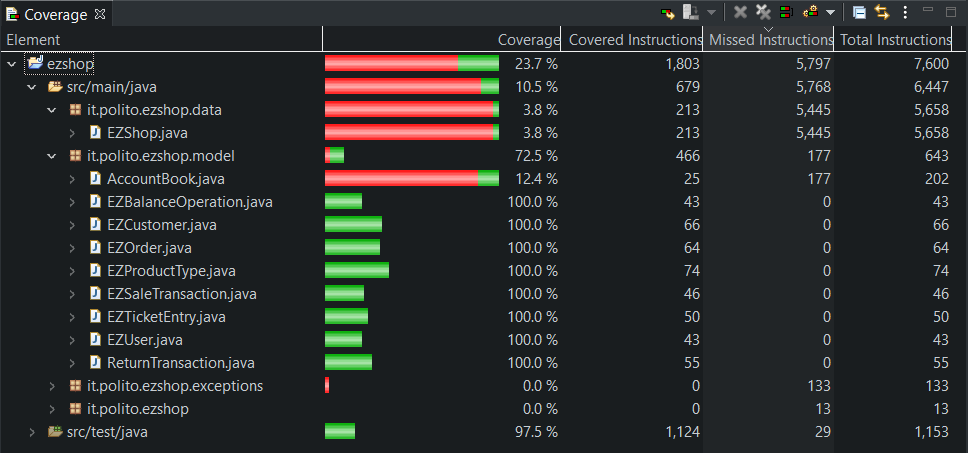

# Unit Testing Documentation

Authors: Alessio Santangelo, Andrea Cencio, Damiano Bonaccorsi, Lorenzo Chiola

Date: 15 May 2021

Version: 1.0

# Contents

- [Black Box Unit Tests](#black-box-unit-tests)
- [White Box Unit Tests](#white-box-unit-tests)

# Black Box Unit Tests

    <Define here criteria, predicates and the combination of predicates for each function of each class.
    Define test cases to cover all equivalence classes and boundary conditions.
    In the table, report the description of the black box test case and (traceability) the correspondence with the JUnit test case writing the 
    class and method name that contains the test case>
    <JUnit test classes must be in src/test/java/it/polito/ezshop   You find here, and you can use,  class TestEzShops.java that is executed  
    to start tests
    >

### **Class *EZCustomer* - method *modifyPointsOnCard***

**Criteria for method *modifyPointsOnCard*:**

- Sign of pointsToBeAdded
- Total points

**Predicates for method *modifyPointsOnCard*:**

| Criteria | Predicate |
| -------- | --------- |
| Sign of pointsToBeAdded | (minint, 0) |
|                         | [0, maxint) |
| Total points            | [0, -pointsToBeAdded) |
|                         | [-pointsToBeAdded, maxint) |

**Boundaries**:

| Criteria | Boundary values |
| -------- | --------------- |
| Sign of pointsToBeAdded | -1, 0, 1 |
| Total points            | 0, -pointsToBeAdded |

**Combination of predicates**:

| Sign of pointsToBeAdded | Total points | Valid / Invalid | Description of the test case | JUnit test case |
|-------|-------|-------|-------|-------|
| (minint, 0) | [0, -pointsToBeAdded) | Invalid | T1(-50) [total points = 20] -> false   Tb1(-1) [total points = 0] -> false | T1(class: ModifyPointsOnCardTest -> method: testNegativePointsToBeAddedFailure)   Tb1(class: ModifyPointsOnCardTest -> method: testNegativePointsToBeAddedFailureBoundary) |
| "" | [-pointsToBeAdded, maxInt) | Valid | T2(-20) [total points = 30] -> true   Tb2(-20) [total points = 20]  -> true | T2(class: ModifyPointsOnCardTest -> method: testNegativePointsToBeAddedSuccess)   Tb2(class: ModifyPointsOnCardTest -> method: testNegativePointsToBeAddedSuccessBoundary) |
| [0, maxint) | * | valid | T1(50) [total points = 10] -> true   Tb3(1) [total points = 0]  -> true | T3(class: ModifyPointsOnCardTest -> method: testPositivePointsToBeAdded)   Tb3(class: ModifyPointsOnCardTest -> method: testPositivePointsToBeAddedBoundary) |

### **Class *EZShop* - method *checkProductBarcodeIsValid***

**Criteria for method *checkProductBarcodeIsValid*:**

- barCode is null
- Length of barCode
- Presence of non-numeric characters
- Correctness of the checksum of barCode

**Predicates for method *checkProductBarcodeIsValid*:**

| Criteria | Predicate |
| -------- | --------- |
| barCode is null | No |
| | Yes |
| Length of barCode | [0, maxint) |
| Presence of non-numeric characters | No |
|  | Yes |
| Correctness of the checksum of barCode | No |
|  | Yes |

**Boundaries**:

| Criteria | Boundary values |
| -------- | --------------- |
| barCode is null                        | - |
| Length of barCode                      | 0, 11, 12, 14, 15 |
| Presence of non-numeric characters     | - |
| Correctness of the checksum of barCode | - |

**Combination of predicates**:

| barCode is null | Length of barCode | Non-numeric characters in barCode | barCode checksum is correct | Valid / Invalid | Description of the test case | JUnit test case |
|-------|-------|-------|-------|-------|-------|-------|
| Yes | - | - | - |Invalid | T1(null) -> false | T1(class: CheckProductBarcodeIsValidTest -> method: test01_nullBarCode) |
| No | [0, 11] | - | - | Invalid | T2("7888387") -> false   Tb2.1("") -> false   Tb2.2("97888386688") -> false | T2(class: CheckProductBarcodeIsValidTest -> method: test03_7CharLongBarCode)   Tb2.1(class: CheckProductBarcodeIsValidTest -> method: test02_emptyBarCode)   Tb2.2(class: CheckProductBarcodeIsValidTest -> method: test03_11CharLongBarCode) |
| " | [12, 14] | Yes | - | Invalid | T3("978883866882A") -> false | T3(class: CheckProductBarcodeIsValidTest -> method: test05_BarCodeWithLetters) |
| " | [12, 14] | No | No | Invalid | T4("123456789012") -> false   Tb4.1("123456789011") -> false   Tb4.2("12345678901234") -> false | T4(class: CheckProductBarcodeIsValidTest -> method: test06_2_wrongCheckSum13BarCode)   Tb4.1(class: CheckProductBarcodeIsValidTest -> method: test06_1_wrongCheckSum12BarCode)   Tb4.2(class: CheckProductBarcodeIsValidTest -> method: test06_3_wrongCheckSum14BarCode) |
| " | [12, 14] | " | Yes | Valid | T5("0123456789005") -> true   Tb5.1("012345678905") -> true   Tb5.2("00012345678905") -> true | T5(class: CheckProductBarcodeIsValidTest -> method: test07_2_correct13BarCode)   Tb5.1(class: CheckProductBarcodeIsValidTest -> method: test07_1_correct12BarCode)   Tb5.2(class: CheckProductBarcodeIsValidTest -> method: test07_3_correct14BarCode) |
| " | [15, maxint) | - | - | Invalid | T6("123456789412301243") -> false   Tb6("978883866882111") -> false | T6(class: CheckProductBarcodeIsValidTest -> method: test04_18CharLongBarBarCode)   Tb6(class: CheckProductBarcodeIsValidTest -> method: test04_15CharLongBarBarCode)  |

### **Class *EZShop* - method *checkCreditCardIsValid***

**Criteria for method *checkCreditCardIsValid*:**

- Being a testable string
- Respecting the Luhn algorithm

**Predicates for method *checkCreditCardIsValid*:**

| Criteria | Predicate |
| -------- | --------- |
| Being a testable string | null |
|                         | empty string |
|                         | not empty string |
| Respecting the Luhn algorithm  | respects it |
|                         | doesn't respect it |

**Boundaries**:

Not meaningful bounderies in this case

**Combination of predicates**:

| Being a testable string | Respecting the Luhn algorithm | Valid / Invalid | Description of the test case | JUnit test case |
|-------|-------|-------|-------|-------|
| null | - | Invalid | T1(null) -> false | T1(class: CheckCreditCardIsValidTest -> method: testNullString) |
| empty string | - | Invalid | T2("") -> false | T2(class: CheckCreditCardIsValidTest -> method: testEmptyString) |
| not empty string | doesn't respect it | Invalid | T3("afv42") -> false | T3(class: CheckCreditCardIsValidTest -> method: testNotEmptyInvalidString) |
| " | respect it | Valid | T4("79927398713") -> true | T4(class: CheckCreditCardIsValidTest -> method: testNotEmptyValidString) |

### **Class *EZShop* - method *checkProductPositionIsValid***

**Criteria for method *checkProductPositionIsValid*:**

- Being a testable string
- Respecting the right format

**Predicates for method *checkProductPositionIsValid*:**

| Criteria | Predicate |
| -------- | --------- |
| Being a testable string | null |
|                         | empty string |
|                         | not empty string |
| Respecting the right format | respects it |
|                         | doesn't respect it |

**Boundaries**:

Not meaningful bounderies in this case

**Combination of predicates**:

| Being a testable string | Respecting the right format | Valid / Invalid | Description of the test case | JUnit test case |
|-------|-------|-------|-------|-------|
| null | - | Invalid | T1(null) -> false | T1(class: CheckProductPositionIsValidTest -> method: testNullString) |
| empty string | - | Invalid | T2("") -> false | T2(class: CheckProductPositionIsValidTest -> method: testEmptyString) |
| not empty string | doesn't respect it | Invalid | T3("fqwe5132") -> false | T3(class: CheckProductPositionIsValidTest -> method: testNotEmptyInvalidString) |
| " | respects it | Valid | T4("11-aa-22") -> true | T4(class: CheckProductPositionIsValidTest -> method: testNotEmptyValidString) |

### **Class *EZShop* - method *checkCreditCardHasEnoughMoney***

**Criteria for method *checkCreditCardHasEnoughMoney*:**

- Being a testable string
- Existing
- Enough money

**Predicates for method *checkCreditCardHasEnoughMoney*:**

| Criteria                | Predicate        |
| ----------------------- | ---------------- |
| Being a testable string | null             |
|                         | empty string     |
|                         | not empty string |
| Existing                | not existing     |
|                         | existing         |
| Enough Money            | enough money     |
|                         | not enough money |

**Boundaries**:

Not meaningful bounderies in this case

**Combination of predicates**:

| Being a testable string | Existing     | Enough Money     | Valid / Invalid | Description of the test case          | JUnit test case                                              |
| ----------------------- | ------------ | ---------------- | --------------- | ------------------------------------- | ------------------------------------------------------------ |
| null                    | -            | - | Invalid         | T1(null, 150.0) -> false              | T1(class: CheckCreditCardHasEnoughMoneyTest -> method: testNullCreditCard) |
| empty string            | -            | - | Invalid         | T2("", 150.0) -> false                | T2(class: CheckCreditCardHasEnoughMoneyTest -> method: testEmptyCreditCardValue) |
| not empty string        | not existing | -                | Invalid         | T3("4716258049958645", 0.0) -> false  | T3(class: CheckCreditCardHasEnoughMoneyTest  -> method: testNotEmptyMissingCreditCard) |
| "                       | existing     | enough money     | Valid           | T4("5100293991053009", 9.0) -> true   | T4(class: CheckCreditCardHasEnoughMoneyTest -> method: testNotEmptyValidCreditCard) |
| "                       | "     | not enough money | Invalid         | T5("5100293991053009", 20.0) -> false | T5(class: CheckCreditCardHasEnoughMoneyTest -> method: testNotEmptyValidCreditCardNotEnoughMoney) |

### **Class *EZCustomer* - method *setPoints***

**Criteria for method *setPoints*:**

- customerCard is null

**Predicates for method *setPoints*:**

| Criteria | Predicate |
| -------- | --------- |
| customerCard is null | No |
|                         | Yes |

**Boundaries**:

Not meaningful bounderies in this case

**Combination of predicates**:

| customerCard is null | Valid / Invalid | Description of the test case | JUnit test case |
|-------|-------|-------|-------|
| Yes | Invalid | T1(setPoints(42); getPoints() == 42) -> false | T1(class: EZCustomerSettersTest -> method: testSetPointsCardExists) |
| No | Valid | T2(setCard("0123456789"); setPoints(42); getPoints() == 42) -> true | T2(class: EZCustomerSettersTest -> method: testSetPointsCardDoesntExist) |

### **Class *EZShop* - method *checkRFIDIsValid***

**Criteria for method *checkRFIDIsValid*:**

- RFID is null
- Length of RFID
- Presence of non-numeric characters

**Predicates for method *checkRFIDIsValid*:**

| Criteria | Predicate |
| -------- | --------- |
| RFID is null | No |
| | Yes |
| Length of RFID | [0, maxint) |
| Presence of non-numeric characters | No |
|  | Yes |

**Boundaries**:

| Criteria | Boundary values |
| -------- | --------------- |
| RFID is null                        | - |
| Length of RFID                      | 11, 12, 13 |
| Presence of non-numeric characters     | - |

**Combination of predicates**:

| RFID    | Is null | Length | Non-numeric | Valid/Invalid | Description of the test case | JUnit test case |
| ------- | ------- | ------ | ----------- | ------------- | ---------------------------- | --------------- |
| (null)  | Yes     | -      | -           | Invalid       | (RFID != null) -> false      | CheckRFIDIsValidTest.test01_nullRFID() |
| ""      | No      | 0      | -           | Invalid       | (RFID != null) -> true, (length == 12) -> false | CheckRFIDIsValidTest.test02_emptyRFID() |
| "01234567890"  | No      | 11     | No          | Invalid       | (RFID != null) -> true, (length == 12) -> false | CheckRFIDIsValidTest.test03_WrongLengthRFID() |
| "0123456789012"  | No      | 13     | No          | Invalid       | (RFID != null) -> true, (length == 12) -> false | CheckRFIDIsValidTest.test03_WrongLengthRFID() |
| "01234567890A" | No      | 12     | Yes         | Invalid       | (RFID != null) -> true, (length == 12) -> true, (is numeric) -> false | CheckRFIDIsValidTest.test04_LettersInRFID() |
| "012345678901" | No      | 12     | No          | Valid         | (RFID != null) -> true, (length == 12) -> true, (is numeric) -> true | CheckRFIDIsValidTest.test05_correctRFID() |

### **Class *EZShop* - method *checkRFIDIsUnique***

Note: checkRFIDIsUnique() does not check the validity of the RFID it receives and assumes it to be valid.
**Criteria for method *checkRFIDIsUnique*:**

- Presence of given RFID in stock

**Predicates for method *checkRFIDIsUnique*:**

| Criteria | Predicate |
| -------- | --------- |
| RFID is already in stock | No |
| | Yes |

**Boundaries**:

| Criteria | Boundary values |
| -------- | --------------- |
| RFID is already in stock | - |

**Combination of predicates**:

| RFID           | Is unique | Valid/Invalid | Description of the test case | JUnit test case |
| -------------- | --------- | ------------- | ---------------------------- | --------------- |
| "012345670010" | No        | Invalid       | (registeredRFIDs.get(RFID) != null | CheckRFIDIsValidTest.test05checkRFIDIsUnique_correctUniqueRFID() |
| "012345670001" | Yes       | Invalid       | (registeredRFIDs.get(RFID) == null | CheckRFIDIsValidTest.test06checkRFIDIsUnique_correctNonUniqueRFID() |

# White Box Unit Tests

### Test cases definition

    <JUnit test classes must be in src/test/java/it/polito/ezshop>
    <Report here all the created JUnit test cases, and the units/classes under test >
    <For traceability write the class and method name that contains the test case>

| Unit name | JUnit test case |
|--|--|
| class: EZBalanceOperation, method: setBalanceId | class: EZBalanceOperationSettersTest, method: testSetBalanceId |
| class: EZBalanceOperation, method: setDate | class: EZBalanceOperationSettersTest, method: testSetDate |
| class: EZBalanceOperation, method: setMoney | class: EZBalanceOperationSettersTest, method: testSetMoney |
| class: EZBalanceOperation, method: setType | class: EZBalanceOperationSettersTest, method: testSetType |
| class: EZCustomer, method: setCustomerName | class: EZCustomerSettersTest, method: testSetCustomerName |
| class: EZCustomer, method: setCustomerCard | class: EZCustomerSettersTest, method: testSetCustomerCard |
| class: EZCustomer, method: setId | class: EZCustomerSettersTest, method: testSetId |
| class: EZCustomer, method: setPoints | class: EZCustomerSettersTest, method: testSetPointsCardDoesntExist |
| " | class: EZCustomerSettersTest, method: testSetPointsCardExists |
| class: EZCustomer, method: modifyPointsOnCard | class: ModifyPointsOnCardTest, method: testNegativePointsToBeAddedFailure |
| " | class: ModifyPointsOnCardTest, method: testNegativePointsToBeAddedFailureBoundary |
| " | class: ModifyPointsOnCardTest, method: testNegativePointsToBeAddedSuccess |
| " | class: ModifyPointsOnCardTest, method: testNegativePointsToBeAddedSuccessBoundary |
| " | class: ModifyPointsOnCardTest, method: testPositivePointsToBeAdded |
| " | class: ModifyPointsOnCardTest, method: testPositivePointsToBeAddedBoundary |
| class: EZOrder, method: setOrderId | class: EZOrderSettersTest, method: testSetOrderId |
| class: EZOrder, method: setProductCode | class: EZOrderSettersTest, method: testSetProductCode |
| class: EZOrder, method: setBalanceId | class: EZOrderSettersTest, method: testSetBalanceId |
| class: EZOrder, method: setPricePerUnit | class: EZOrderSettersTest, method: testSetPricePerUnit |
| class: EZOrder, method: setQuantity | class: EZOrderSettersTest, method: testSetQuantity |
| class: EZOrder, method: setStatus | class: EZOrderSettersTest, method: testSetStatus |
| class: EZProductType, method: setQuantity | class: EZProductTypeSettersTest, method: testSetQuantity |
| class: EZProductType, method: setLocation | class: EZProductTypeSettersTest, method: testSetLocation |
| class: EZProductType, method: setNote | class: EZProductTypeSettersTest, method: testSetNote |
| class: EZProductType, method: setProductDescription | class: EZProductTypeSettersTest, method: testSetProductDescription |
| class: EZProductType, method: setBarCode | class: EZProductTypeSettersTest, method: testSetBarCode |
| class: EZProductType, method: setPricePerUnit | class: EZProductTypeSettersTest, method: testSetPricePerUnit |
| class: EZProductType, method: setId | class: EZProductTypeSettersTest, method: testSetId |
| class: EZSaleTransaction, method: setTicketNumber | class: EZSaleTransactionSettersTest, method: testSetTicketNumber |
| class: EZSaleTransaction, method: setEntries | class: EZSaleTransactionSettersTest, method: testSetEntries |
| class: EZSaleTransaction, method: setDiscountRate | class: EZSaleTransactionSettersTest, method: testSetDiscountRate |
| class: EZSaleTransaction, method: setPrice | class: EZSaleTransactionSettersTest, method: testSetPrice |
| class: EZSaleTransaction, method: setStatus | class: EZSaleTransactionSettersTest, method: testSetStatus |
| class: EZTicketEntry, method: setBarCode | class: EZTicketEntrySettersTest, method: testSetBarCode |
| class: EZTicketEntry, method: setProductDescription | class: EZTicketEntrySettersTest, method: testSetProductDescription |
| class: EZTicketEntry, method: setAmount | class: EZTicketEntrySettersTest, method: testSetAmount |
| class: EZTicketEntry, method: setPricePerUnit | class: EZTicketEntrySettersTest, method: testSetPricePerUnit |
| class: EZTicketEntry, method: setDiscountRate | class: EZTicketEntrySettersTest, method: testSetDiscountRate |
| class: EZUser, method: setId | class: EZUserSettersTest, method: testSetId |
| class: EZUser, method: setUsername | class: EZUserSettersTest, method: testSetUsername |
| class: EZUser, method: setPassword | class: EZUserSettersTest, method: testSetPassword |
| class: EZUser, method: setRole | class: EZUserSettersTest, method: testSetRole |
| class: AccountBook, method: setCurrentBalance | class: AccountBookSettersTest, method: testSetCurrentBalance |
| class: AccountBook, method: setOperations | class: AccountBookSettersTest, method: testSetOperations |
| class: ReturnTransaction, method: setUsername | class: ReturnTransactionSettersTest, method: testSetUsername |
| class: ReturnTransaction, method: setSaleId | class: ReturnTransactionSettersTest, method: testSetSaleId |
| class: ReturnTransaction, method: setProducts | class: ReturnTransactionSettersTest, method: testSetProducts |
| class: ReturnTransaction, method: setMoneyToReturn | class: ReturnTransactionSettersTest, method: testSetMoneyToReturn |
| class: ReturnTransaction, method: sestSetState | class: ReturnTransactionSettersTest, method: testSetState |
| class: EZShop, method: checkProductBarcodeIsValid | class: checkProductBarcodeIsValidTest, method: test01_nullBarCode |
| " | class: checkProductBarcodeIsValidTest, method: test02_emptyBarCode |
| " | class: checkProductBarcodeIsValidTest, method: test03_7CharLongBarCode |
| " | class: checkProductBarcodeIsValidTest, method: test03_11CharLongBarCode |
| " | class: checkProductBarcodeIsValidTest, method: test04_15CharLongBarBarCode |
| " | class: checkProductBarcodeIsValidTest, method: test04_18CharLongBarBarCode |
| " | class: checkProductBarcodeIsValidTest, method: test05_BarCodeWithLetters |
| " | class: checkProductBarcodeIsValidTest, method: test06_1_wrongCheckSum12BarCode |
| " | class: checkProductBarcodeIsValidTest, method: test06_2_wrongCheckSum13BarCode |
| " | class: checkProductBarcodeIsValidTest, method: test06_3_wrongCheckSum14BarCode |
| " | class: checkProductBarcodeIsValidTest, method: test07_1_correct12BarCode |
| " | class: checkProductBarcodeIsValidTest, method: test07_2_correct13BarCode |
| " | class: checkProductBarcodeIsValidTest, method: test07_3_correct14BarCode |
| " | class: checkProductBarcodeIsValidTest, method: test07_4_correct12BarCode |
| " | class: checkProductBarcodeIsValidTest, method: test07_5_correct12BarCode |
| " | class: checkProductBarcodeIsValidTest, method: test07_6_correct13BarCode |
| " | class: checkProductBarcodeIsValidTest, method: test07_7_correct14BarCode |
| class: EZShop, method: checkCreditCardIsValid | class: CheckCreditCardIsValidTest, method: testNullString |
| " | class: CheckCreditCardIsValidTest, method: testEmptyString |
| " | class: CheckCreditCardIsValidTest, method: testNotEmptyInvalidString |
| " | class: CheckCreditCardIsValidTest, method: testNotEmptyValidString |
| " | class: CheckCreditCardIsValidTest, method: testSingleIteration |
| class: EZShop, method: checkProductPositionIsValid | class: CheckProductPositionIsValidTest, method: testNullString |
| " | class: CheckProductPositionIsValidTest, method: testEmptyString |
| " | class: CheckProductPositionIsValidTest, method: testNotEmptyInvalidString |
| " | class: CheckProductPositionIsValidTest, method: testNotEmptyValidString |
| class: EZShop, method: checkCreditCardHasEnoughMoney | class: CheckCreditCardHasEnoughMoneyTest, method: testNullCreditCard |
| " | class: CheckCreditCardHasEnoughMoneyTest, method: testEmptyCreditCardValue |
| " | class: CheckCreditCardHasEnoughMoneyTest, method: testNotEmptyMissingCreditCard |
| " | class: CheckCreditCardHasEnoughMoneyTest, method: testNotEmptyValidCreditCard |
| " | class: CheckCreditCardHasEnoughMoneyTest, method: testNotEmptyValidCreditCardNotEnoughMoney |

### Code coverage report

    <Add here the screenshot report of the statement and branch coverage obtained using
    the Eclemma tool. >

**Coverage obtained with the above mentioned unit tests**:

### Loop coverage analysis

    <Identify significant loops in the units and reports the test cases
    developed to cover zero, one or multiple iterations >

|Unit name | Loop rows | Number of iterations | JUnit test case |
|---|---|---|---|
| checkProductBarcodeIsValid | 16 | 0 | Tb2.1(class: CheckProductBarcodeIsValidTest -> method: test02_emptyBarCode) |
|                            | 16 | 1 | not possible |
|                            | 16 | multiple | checkProductBarcodeIsValid.test07_2_correct13BarCode() |
| checkCreditCardIsValid | 9 | 0 | T2(class: CheckCreditCardIsValidTest -> method: testEmptyString) |
|  | 9 | 1 | T5(class: CheckCreditCardIsValidTest -> method: testSingleIteration) |
|  | 9 | multiple | T4(class: CheckCreditCardIsValidTest -> method: testNotEmptyValidString) |
